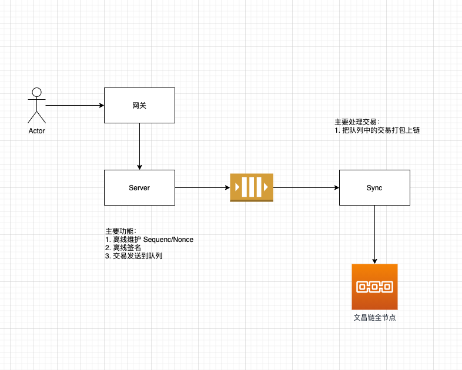

# 文昌链最佳实践建议

## 简介
随着文昌链的业务增加，目前很多客户遇到了很多问题，为此我们决定写一篇最佳实践来指导解决社区的问题

### 概念介绍

节点分类：

共识节点：区块链网络中负责出块的网络
全节点：区块链网络中负责接收查询交易的节点（不参与共识）

## 实施建议

### 建议1: 及时关注社区的咨询

文昌链现在的业务发展非常快，技术服务团队会第一时间更新链的服务发展，例如：

1. 链升级内容及对用户的影响
2. 产品升级内容及对用户的影响
3. 升级时间对用户造成的影响
4. SDK & AVATA 的更新内容及对产品的影响
5. 同时社区中还有其他热心社区成员提供帮助，有机器人帮助你找到不同资源的入口


### 建议2: 使用 Sync 模式而不是 Commit 模式或 Async 模式提交交易

#### 不同交易模式的解释：

1. Commit 模式：用户提交交易后会建立一个结果接收线程等待链通知交易执行的结果；
2. Sync 模式：用户提交交易后会链经过验证后会返回给用户一个交易 hash
3. Async 模式：用户提交交易后，立刻返回一个交易 hash

#### 为什么要使用 Sync 模式？

1. Commit 模式 **不推荐使用**：在链的并发较大时，可能会导致等待线程超时，无法把当前交易的执行结果返回给用户。如果链的压力比较大的时候，交易可能无法发送。（未来的计划是会删除此种交易模式）
2. Sync 模式 **推荐使用**：对于用户提交的交易，Sync 模式发送的交易，只需要经过了合法性验证就可以进入 mempool(交易池) 等待被广播到共识节点，用户如果想要拿到结果，仅需要查询一次提交交易返回的 hash 即可，读写分离，性能高
3. Async 模式 **不推荐使用**： Async 模式不做任何的交易校验执行，仅会根据当前的交易内容返回一个 hash，用户无法感知交易是否被发送到链上。

#### 示例
##### OPB-SDK-Go

对于使用 opb-sdk-go 的用户在配置的时候请做如下配置：

```go
    options := []types.Option{
        types.KeyDAOOption(store.NewMemory(nil)),
        types.FeeOption(types.NewDecCoinsFromCoins(fee)),
        types.ModeOption(coretypes.Sync), // 配置广播模式
    }
    //..... 其他掠过
    // 初始化 Tx 基础参数
    baseTx := types.BaseTx{
        From:     "test_key_name", // 对应上面导入的私钥名称
        Password: "test_password", // 对应上面导入的私钥密码
        Gas:      200000,          // 单 Tx 消耗的 Gas 上限
        Memo:     "",              // Tx 备注
        Mode:     types.Sync,    // Tx 广播模式
    }
```

### 建议3: 离线维护 Sequence/Nonce 并配合 Sync 模式

推荐架构如下：



#### 示例

##### 对于 OPB-SDK-Go

opb-sdk-go 默认做了维护 sequence （注意：不要完全信任，这个值是存在于内存中的，如果网络抖动，可能会导致 sequence 不对）可以用如下方式自己本地静态维护：
##### 签名和广播不分开

```go

    // 伪代码
    options := []types.Option{
        types.KeyDAOOption(store.NewMemory(nil)),
        types.FeeOption(types.NewDecCoinsFromCoins(fee)),
        types.ModeOption(coretypes.Sync),
    }
    
    //  ..... 其他掠过
    // 创建客户端
    client := opb.NewClient(cfg, &authToken)
    
    // 初始化 Tx 基础参数
    baseTx := types.BaseTx{
        From:     "test_key_name", // 对应上面导入的私钥名称
        Password: "test_password", // 对应上面导入的私钥密码
        Gas:      200000,          // 单 Tx 消耗的 Gas 上限
        Memo:     "",              // Tx 备注
        Mode:     types.Sync,    // Tx 广播模式
    }
    accountAddr := "iaa1lxvmp9h0v0dhzetmhstrmw3ecpplp5tljnr35f"
    baseAccount, err := client.QueryAccount(accountAddr)
    if err != nil {
        return
    }
    
    // 初始的 sequence 可以从 baseAccount 拿到
    // 获取最新的离线的 sequence
    sequence = getCurSequence(accountAddr)
    
    // 创建写入的 msgs
    // msgs 是一个接口数组，任何文昌链的原生交易的结构都可以 append 到这个数组
    var msgs coretypes.Msgs
    tmpNFTID := "testnft001"
    tmpMsg := &nft.MsgMintNFT{
        Id:        tmpNFTID,
        DenomId:   "testclass",
        Name:      "testnftname",
        URI:       "http://example.com",
        Data:      "",
        Sender:    accountAddr,
        Recipient: accountAddr,
    }
    msgs = append(msgs, tmpMsg)
    
    // 签名并广播
    result, err := client.BuildAndSend(msgs, baseTx)
	if err != nil {
		return
	}
 
    // 更新sequence(必须等结果返回后，这个时候代表交易已经进入链的交易池子，等待被广播)
    sequence += 1

    //.....

```

###### 签名和广播分开（推荐做法，和架构图一致）

```go

    // 伪代码
    options := []types.Option{
        types.KeyDAOOption(store.NewMemory(nil)),
        types.FeeOption(types.NewDecCoinsFromCoins(fee)),
        types.ModeOption(coretypes.Sync),
    }
    
    //  ..... 其他掠过
    // 创建客户端
    client := opb.NewClient(cfg, &authToken)
    
    // 初始化 Tx 基础参数
    baseTx := types.BaseTx{
        From:     "test_key_name", // 对应上面导入的私钥名称
        Password: "test_password", // 对应上面导入的私钥密码
        Gas:      200000,          // 单 Tx 消耗的 Gas 上限
        Memo:     "",              // Tx 备注
        Mode:     types.Sync,    // Tx 广播模式
    }
    accountAddr := "iaa1lxvmp9h0v0dhzetmhstrmw3ecpplp5tljnr35f"
    baseAccount, err := client.QueryAccount(accountAddr)
    if err != nil {
        return
    }
    
    // 初始的 sequence 可以从 baseAccount 拿到
    // 获取最新的离线的 sequence
    sequence = getCurSequence(accountAddr)
    
    // 创建写入的 msgs
    // msgs 是一个接口数组，任何文昌链的原生交易的结构都可以 append 到这个数组
    var msgs coretypes.Msgs
    tmpNFTID := "testnft001"
    tmpMsg := &nft.MsgMintNFT{
        Id:        tmpNFTID,
        DenomId:   "testclass",
        Name:      "testnftname",
        URI:       "http://example.com",
        Data:      "",
        Sender:    accountAddr,
        Recipient: accountAddr,
    }
    msgs = append(msgs, tmpMsg)
    
    // 签名
    signTx, err := client.BuildAndSignWithAccount(feeGraterAddr, baseAccount.AccountNumber, sequence, msgs, baseTx)

    if err != nil{
        return
    }

    // 广播
    result, err := tc.BroadcastTxSync(context.Background(), signTx)
    if err != nil{
        return
    }
    // 注意签名和广播可以放到不同的程序中，参考架构图
 
    // 更新sequence(必须等结果返回后，这个时候代表交易已经进入链的交易池子，等待被广播)
    sequence += 1

    //.....

```

### 建议4：一笔交易包含多 Msg 代替多笔交易只包含 1 个 Msg

#### 概念解释：

1. 交易：一笔完整的链上可执行的事务，每一笔交易必须包含大于等于 1 的 Msg；
2. Msg：一笔交易的消息体，真正与业务相关的结构；

#### 为什么要这么做？

我们来模拟一个真实的场景：用户想要创建 1000 个 NFT；那么我有如下两种方案：

1. 方案1：创建 1000 笔交易，每笔交易包含 1 个 NFT Msg 
2. 方案2：创建一笔交易，此交易包含 1000 个 NFT Msg 

那么那种方案更好呢？答案是：方案2。这是因为：**每笔交易上链后都需要进行交易的验证**，方案2 比 方案1 少执行了 999 次的交易验证，在性能上更加优秀，交易速度更快。

#### 示例
##### 对于 OPB-SDK-Go

一笔交易多 Msg 的示例：把上述的建议3的代码示例稍为改造一下：

```go
    // ....
    
    // 创建写入的 msgs
    // msgs 是一个接口数组，任何文昌链的原生交易的结构都可以 append 到这个数组
    var msgs coretypes.Msgs
    for i:=0; i< 1000; i++{
        tmpNFTID := fmt.Sprintf("testnft%d",  i)
        tmpMsg := &nft.MsgMintNFT{
            Id:        tmpNFTID,
            DenomId:   "testclass",
            Name:      "testnftname",
            URI:       "http://example.com",
            Data:      "",
            Sender:    accountAddr,
            Recipient: accountAddr,
        }
        msgs = append(msgs, tmpMsg)
    }
     
    // 签名
    signTx, err := client.BuildAndSignWithAccount(feeGraterAddr, baseAccount.AccountNumber, sequence, msgs, baseTx)

    if err != nil{
        return
    }

    // 广播
    result, err := tc.BroadcastTxSync(context.Background(), signTx)
    if err != nil{
        return
    }
    // 注意签名和广播可以放到不同的程序中，参考架构图
 
    // 更新sequence(必须等结果返回后，这个时候代表交易已经进入链的交易池子，等待被广播)
    sequence += 1
    //....
```

### 建议5：对于 EVM 交易和 DDC 的并发交易必须离线维护 Nonce

**所有的交易是由全节点接收的。** 
当区块链网络的压力比较大时，全节点的交易可能无法被及时的 广播到共识节点，如果不离线维护 Nonce 值，可能会导致出现一些关于 Nonce 值的错误；
#### 使用建议

1. 如果你是使用 DDC-SDK-Java 的用户请使用 SDK 中 setNonce 的操作
2. 如果你是使用其他 web3 SDK 请根据他们文档中提供的方式设置 Nonce
3. 最佳实践架构和 建议3 类似

**注意：** 对于 EVM 交易，正确的做法是：**发送完一笔交易后查询一下交易的执行结果。** EVM 的目前的机制是调用失败 Nonce 值不会增加